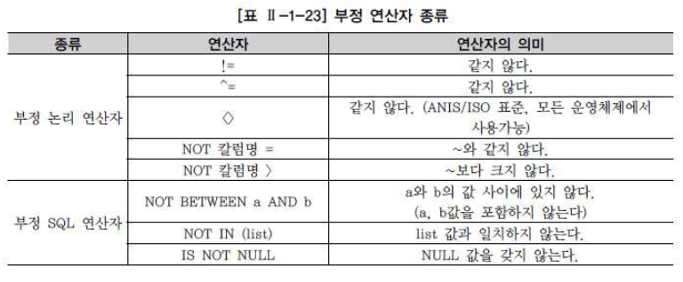

---
과목2 SQL 기본 및 활용
1장 SQL 기본
---

# 관계형 데이터베이스 개요

1. 데이터베이스
   - 넓은 의미 : 일상적인 정보들을 모아 놓은 것 자체
   - 일반적인 의미 : 특정 기업이나 조직 또는 개인이 필요에 의해 데이터를 일정한 형태로 저장해 놓은 것
   - 쏟아져 나오는 다양한 정보들을 수집, 처리, 분석, 응용하는 것의 필요성이 높아지면서 발생
   - 데이터베이스의 발전
     - 1960s : 플로우차트 중심의 개발
     - 1970s : 데이터베이스 관리 기법이 처음 태동
     - 1980s : 오라클, 시베이스 등의 RDB 상용화
     - 1990s : 기존의 제품들이 향상됨, 객체 RDB로 발전
   - RDB
     - 1970년 코드 박사의 논문에서 처음 소개
     - 오라클을 선발로 여러 회사에서 상용화 제품을 출시
     - 계층형,망형 데이터베이스를 대체하며 주력 DB로 성장
     - 데이터의 중복을 피하고 정합성을 보장하기 위해 RDB가 사용되기 시작했다
     - RDB는 메타 데이터를 총괄 관리할수 있기 때문에 성격,속성 또는 표현 방법 등을 체계화 할 수 있다
     - 데이터 표준화를 통해 데이터 품질을 확보할 수 있다
     - 갑작스런 장애로부터 데이터가 정상적으로 반영될 수 있도록 보장해준다
     - 시스템 다운, 재해 등의 상황에서도 데이터를 회복,복구할 수 있는 능력이 있다
2. SQL

   - RDB에서 데이터 정의, 데이터 조작, 데이터 제어를 하기 위해 사용되는 언어
   - ANSI/ISO를 통해 표준화되고 정의되어 오고 있다
   - 일반적인 프로그래밍 언어와 달리, RDB에 대한 전담 접속용도로 사용되어 독립되어있다
   - 수학의 집합 논리에 입각한 언어다
   - DDL,DML,DCL로 나뉜다 (나중에 다룸)

3. TABLE
   - 데이터베이스의 기본 단위
   - 어느 특정한 주제와 목적으로 만들어지는 일종의 `집합`
   - 테이블
     - 행과 칼럼의 2차원 구조를 가진 데이터의 저장 장소이며, 데이터베이스의 가장 기본적인 개념
   - 칼럼/열
     - 2차원 구조를 가진 테이블에서 세로 방향으로 이루어진 하나하나의 특정 속성
   - 행
     - 2차원 구조를 가진 테이블에서 가로 방향으로 이루어진 연결된 데이터
   - 정규화
     - 이 테이블을 분할하여 불필요한 중복을 줄이는 것
     - 입력/수정/삭제 시 발생할 수 있는 이상현상을 방지하기 위한 매우 중요한 프로세스
   - 기본키와 외부키
     - 기본키 : 테이블에 존재하는 각 행을 한가지 의미로 특정할 수 있는 한개 이상의 칼럼
     - 외부키 : 다른 테이블의 기본키로 사용되고 있는 관계를 연결하는 칼럼
4. ERD
   - 다른 테이블과의 관계의 의미를 직관적으로 표현할 수 있는 수단
   - Entity-Relation Diagram, 즉 엔티티와 관계를 설명하는 그림이다

# DDL(DATA DEFINITION LANGUAGE)

# DML(DATA MANIPULATION LANGUAGE )

# TCL(TRANSACTION CONTROL LANGUAGE)

# WHERE 절

1. where 조건절 개요
   - 원하는 자료를 검색하기 위한 조건절이다
   - where 절에서는 두 개 이상의 테이블에 대한 조인 조건이나 결과를 제한하기 위한 조건을 기술할 수도 있다
   - where절은 조회하려는 데이터에 특정 조건을 부여할 목적으로 사용하기 때문에 다음과 같이 FROM절 뒤에 오게 된다

```sql
SELECT [DISTINCT/ALL] 칼럼명 [ALIAS명]
FROM 테이블명
WHERE 조건식;
```

- WHERE 절의 조건식은 아래 내용으로 구성된다
  - 칼럼명(보통 조건식의 좌측 위치)
  - 비교 연산자
  - 문자,숫자,표현식(보통 조건식의 우측에 위치)
  - 비교 칼럼명(JOIN사용시)

2. 연산자의 종류

- 비교 연산자

  - `=`
    - 같다
  - `>`
    - 보다 크다
  - `>=`
    - 보다 크거나 같다
  - `<`
    - 보다 작다
  - `<=`
    - 보다 작거나 같다

- SQL 연산자
  - `BETWEEN a AND b`
    - a와 b의 값 사이에 잇으면 된다(a와 b값 포함)
  - `IN(list)`
    - 리스트에 있는 값 중에서 어느 하나라도 일치하면 된다
  - `LIKE`
    - 비교문자열과 형태가 일치하면 된다.(%,\_사용)
  - `IS NULL`
    - NULL 값인 경우
- 논리 연산자
  - `AND`
    - 앞에 있는 조건과 뒤에 오는 조건이 참이되면 결과도 참이 된다 즉 앞의 조건과 뒤의 조건을 동시에 만족해야한다
  - `OR`
    - 앞의 조건이 참이거나 뒤의 조건이 참이 되어야 결과도 결과도 참이 된다. 즉 앞뒤 조건 중 하나만 참이면 된다
  - `NOT`
    - 뒤에 오는 조건에 반대되는 결과를 돌려준다
- 부정 비교 연산자
  - `!=`
    - 같지 않다
  - `^=`
    - 같지 않다
  - `<>`
    - 같지 않다(ISO 표준, 모든 운영체제에서 사용 가능)
  - `NOT 칼럼명 =`
    - ~와 같지 않다
  - `NOT 칼럼명 >`
    - ~보다 크지 않다
- 부정 SQL 연산자
  - `NOT BETWEEN a AND b`
    - a와 b의 값 사이에 있지 않다( a,b값을 포함하지 않는다)
  - `NOT IN`
    - list 값과 일치하지 않는다
  - `IS NOT NULL`
    - NULL 값을 갖지 않는다
- 연산자의 우선순위
  1. 괄호
  2. NOT 연산자
  3. 비교 연산자, SQL 비교연산자
  4. AND
  5. OR

3. 비교 연산자
   - 칼럼들을 특정한 값들과 조건을 비교하는데 사용할 수 있었다
   - 예문
   ```sql
   SELECT PLAYER_NAME, POSITION, BACK_NO, HEIGHT
   FROM PLAYER
   WHERE TEAM_ID = 'KO2'
   WHERE POSITION = 'MF'
   ```
   - 문자 유형의 칼럼은 다음과 같이 ''처리를 해줘야 한다
   - 숫자 유형의 칼럼은 숫자로 변환이 가능한 문자열과 비교되면 상대 타입을 숫자 타입으로 바꾸어 비교한다
4. SQL 연산자

   - SQL 문장에서 사용하도록 예약되어있는 연산자
   - 모든 데이터 타입에 있어서 다음과 같은 종류가 있다
     - `BETWEEN a AND b`
       - a와 b의 값 사이에 잇으면 된다(a와 b값 포함)
     - `IN(list)`
       - 리스트에 있는 값 중에서 어느 하나라도 일치하면 된다
     - `LIKE`
       - 비교문자열과 형태가 일치하면 된다.(%,\_사용)
     - `IS NULL`
       - NULL 값인 경우
   - `IN` 연산자 활용
     - 예문
     ```sql
     SELECT ENAME,JOB,DEPTNO
     FROM EMP
     WHERE (JOB,DEPTNO) IN (('MANAGER',20),('CLERK',30))
     ```
     - 다중 리스트를 이용한 `IN` 연산자는 SQL 문장을 짧게 만들어 주면서 성능 측면에서도 장점을 가질 수 있는 연산자다
   - `LIKE` 연산자 활용
     - 예문
     ```sql
       SELECT PLAYER_NAME, POSITION, BACK_NO, HEIGHT
       FROM PLAYER
       WHERE PLAYER_NAME LIKE '장%'
     ```
     - 다음 예문은 '장'씨 성을 가진 선수들의 정보를 조회하는 WHERE 절을 작성한 것이다
     - `%` 와일드카드를 사용하면 다음과 같이 '장'으로 시작하는 이름을 가진 선수들의 정보를 조회할 수 있다
     - 와일드카드
       - 한개 혹은 0개 이상의 문자를 대신해서 사용하기 위한 특수 문자를 의미한다
       - SQL 문장에서 사용하는 STRING 값으로 용이하게 사용할 수 있다
       - `%` 와일드카드
         - 0개 이상의 어떤 문자를 의미한다
       - `_` 와일드카드
         - 1개인 단일 문자를 의미한다
   - `BETWEEN a AND b` 연산자
     - 예문
       ```sql
        SELECT PLAYER_NAME, POSITION, BACK_NO, HEIGHT
        FROM PLAYER
        WHERE HEIGHT BETWEEN 170 AND 180;
       ```
     - 다음 예문에서 범위는 170과 180을 포함하는 것을 의미한다
   - `IS NULL`
     - `NULL`은 값이 존재하지 않는 것
     - 확정되지 않은 값을 표현할때 사용한다
     - 공백이나 0과 같은 값과 비교 자체가 불가능한 값이다
       - `NULL` 값과의 수치연산은 NULL 값을 리턴한다
       - `NULL` 값과의 비교연산은 거짓(`FALSE`)을 리턴한다
       - 어떤 값과 비교할 수도 없다
       - 특정값보다 크다 적다라는 표현을 할 수도 없다
     - 따라서 NULL 값의 비교는 비교연산자를 통해서 비교할 수 없다
     - 비교한다 해도 `FALSE`를 리턴한다
     - NULL 값의 비교 연산은 `IS NULL` 혹은 `IS NOT NULL`이라는 정해진 문구를 사용해야 제대로 된 결과를 얻을 수 있다
     - 예문

   ```sql
    SELECT PLAYER_NAME, POSITION, BACK_NO, HEIGHT
    FROM PLAYER
    WHERE POSTION = NULL;
    ## 다음 구문은 선택된 레코드가 없다는 메시지를 출력한다

    SELECT PLAYER_NAME, POSITION, BACK_NO, HEIGHT
    FROM PLAYER
    WHERE POSTION IS NULL;
    ## 한편 다음과 같이 IS NULL 연산자를 사용한다면 포지션값이 없는 선수의 데이터를 조회할 수 있는 것이다
   ```

5. 논리 연산자

   - 논리 연산자는 비교 연산자나 SQL 연산자로 이루어진 여러 개의 **조건**들을 논리적으로 연결시키기 위해 사용되는 연산자다
   - 논리 연산자
     - `AND`
       - 앞에 있는 조건과 뒤에 오는 조건이 참이되면 결과도 참이 된다 즉 앞의 조건과 뒤의 조건을 동시에 만족해야한다
     - `OR`
       - 앞의 조건이 참이거나 뒤의 조건이 참이 되어야 결과도 결과도 참이 된다. 즉 앞뒤 조건 중 하나만 참이면 된다
     - `NOT`
       - 뒤에 오는 조건에 반대되는 결과를 돌려준다
   - 예문

   ```sql
   SELECT PLAYER_NAME, POSITION, BACK_NO, HEIGHT
   FROM PLAYER
   WHERE TEAM_ID = 'KO2' OR TEAM_ID = 'K07'
   AND HEIGHT >= 170
   AND POSTION = 'MF';
   ```

   - 다음 예문에서는 팀 아이디에 대한 `OR` 연산자 사용에 있어서 괄호 처리를 안했기 때문에 팀 아이디가 해당 값인 정보들이 전부 불러와지면서 이후의 `AND` 연산이 의미가 없어졌다
   - 논리 연산자의 처리 우선순위는 `()`,`NOT`,`AND`,`OR`이기 때문에 위의 경우 괄호처리를 다음과 같이 해줘야한다
   - 수정 예문

   ```sql
   SELECT PLAYER_NAME, POSITION, BACK_NO, HEIGHT
   FROM PLAYER
   WHERE (TEAM_ID = 'KO2' OR TEAM_ID = 'K07')
   AND HEIGHT >= 170
   AND POSTION = 'MF';
   ```

   - 이 부분은 typeORM에서는 bracket을 활용하면 되지 않을까 싶다

6. 부정 연산자
   - 
   - 비교 연산자, SQL 비교 연산자에 대한 부정 표현을 부정 연산자로 할 수 있다
   - 예문
   ```sql
   SELECT PLAYER_NAME, POSITION, BACK_NO, HEIGHT
   FROM PLAYER
   WHERE TEAM_ID = 'KO2'
   AND NOT HEIGHT BETWEEN 175 AND 185
   AND NOT POSTION = 'MF';
   ## 포지션이 미드필더가 아니고 키가 175 이상 185 이하가 아닌 선수들의 자료를 조회하는 구문
   ```
7. ROWNUM, TOP 사용

   - `ROWNUM`
     - 오라클의 `ROWNUM`은 칼럼과 비슷한 성격의 Pseudo Column으로 SQL 처리 결과 집합의 각 행에 대해 임시로 부여되는 일련번호다
     - 테이블이나 집합에서 원하는 만큼의 행만 가져오고 싶을 때 WHERE 절에서 행의 개수를 제한하는 목적으로 사용된다
     - 예문

   ```sql
   SELECT PLAYER_NAME
   FROM PLAYER
   WHERE ROWNUM=1;
   혹은
   WHERE ROWNUM<=1;

   ## N건의 행을 가져오고 싶을 떄는
   WHERE ROWNUM<=N;
   ```

   - 위와 같이 출력되는 행의 한계를 지정할 수 있다
   - 추가적으로 테이블 내의 고유한 키나 인덱스 값을 만들 수 있다

- `TOP`
  - 결과 집합으로 출력되는 행의 수를 제한할수 있다
  - 사용법
    ```sql
    TOP (Expression) [PERCENT][WITH TIES]
    ```
    - Expression
      - 반환할 행의 수를 지정하는 숫자
    - PERCENT
      - 쿼리 결과의 집합에서 처음 Expression의 행만 반환됨을 나타낸다
    - WITH TIES
      - `ORDER BY`절이 지정된 경우에만 사용할 수 있으며, `TOP N`의 마지막 행과 같은 값이 있는 경우 추가 행이 출력되도록 지정할 수 있다
  - 한건의 행만 가져오고 싶을 때 예문
    ```sql
    SELECT TOP(1) PLAYER_NAME
    FROM PLAYER
    ```
  - 두건 이상의 N 행을 가져오고 싶을 때 예문
    ```sql
    SELECT TOP(N) PLAYER_NAME
    FROM PLAYER
    ```

# 함수(FUNCTION)

# GROUP BY, HAVING 절

# 조인(JOIN)
